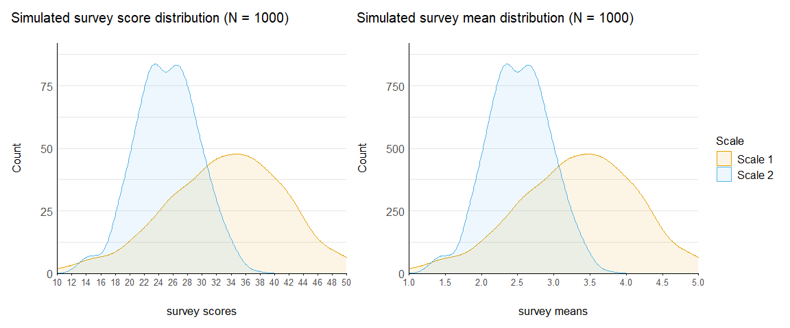
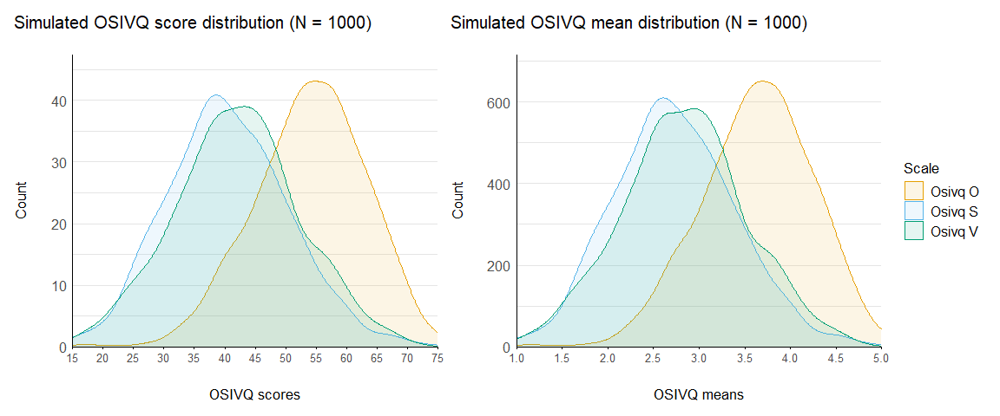

# Simulating Likert-type questionnaire data with R


I have been working on multiple projects that involved analysing
questionnaires with “Likert scales”, i.e. ordinal variables or
pseudo-continuous variables obtained by summing all the ordinal items.
Before engaging into the experiments proper, we should conduct robust
power analyses, code testing, sanity checks, etc. to ensure that the
data collection and analysis will be as smooth as possible. In several
complex settings such as multivariate analyses or multilevel modelling,
simulation can be a powerful tool to do these tasks by allowing to test
intricate computations on synthetic data.

> I found out (*after the deed, of course*) that several packages
> already existed that could have eased my work. The closest to what I
> coded here is the
> [`LikertMakeR`](https://github.com/WinzarH/LikertMakeR) package, which
> is really comprehensive. Also check out
> [`latent2likert`](https://github.com/markolalovic/latent2likert) for a
> more item-based simulation approach. *Note: this is not a standalone
> package because I don’t think the functions add a signficant
> improvement over those from the packages above, but I like the
> straightforward solutions I came up with, which is why I document them
> here.*[^1]

``` r
source("scripts/simulate_questionnaires.R")
source("scripts/plot_questionnaires.R")
```

## Simulate items for a given score

My initial problem was to find a way to simulate a fixed number of
bounded ordinal variables (questionnaire items) that sum to a given
score. I wanted to be able to simulate the score distributions of a
whole population on a multi-item questionnaire based on literature or
assumptions, ***then*** simulate individual items making up the scale
(which is the reverse process of more “item-based” approaches like
[`latent2likert`](https://github.com/markolalovic/latent2likert)). This
resulted in the `simulate_items` function[^2]: given a score, a number
of items, a minimum and a maximum value, it returns a vector of
simulated items.

``` r
# Subject with a score of 32 on a 12-item questionnaire ranging from 1 to 5
simulate_items(score = 32, n_items = 12, min_item = 1, max_item = 5)
```

     [1] 1 4 2 2 3 2 3 3 2 1 4 5

``` r
# Subject with a score of 35 on a 8-item questionnaire ranging from 1 to 7
simulate_items(35, 8, 1, 7, verbose = TRUE)
```

    Item scores are  7 7 2 2 4 4 5 4  with a total score of  35 

    [1] 7 7 2 2 4 4 5 4

It can be mapped on a distribution to simulate the items for a whole
sample of subjects.

``` r
n_subjects <- 50

# Normal distribution of scores
df <- 
  tibble(
    subject = 1:n_subjects,
    score = rnorm(n_subjects, mean = 32, sd = 5) |> round()
  ) |>
  rowwise() |> 
  mutate(item = list(simulate_items(score, n_items = 12, min_item = 1, max_item = 5))) |> 
  unnest_wider(item, names_sep = "_")

df |> head() |> display()
```

| subject | score | item_1 | item_2 | item_3 | item_4 | item_5 | item_6 | item_7 | item_8 | item_9 | item_10 | item_11 | item_12 |
|:---|---:|---:|---:|---:|---:|---:|---:|---:|---:|---:|---:|---:|---:|
| 1 | 35 | 4 | 1 | 3 | 2 | 1 | 4 | 1 | 5 | 2 | 4 | 3 | 5 |
| 2 | 23 | 3 | 2 | 5 | 2 | 1 | 1 | 1 | 1 | 1 | 1 | 3 | 2 |
| 3 | 30 | 2 | 2 | 3 | 2 | 1 | 2 | 4 | 2 | 3 | 5 | 2 | 2 |
| 4 | 34 | 2 | 4 | 3 | 2 | 4 | 3 | 5 | 3 | 2 | 3 | 1 | 2 |
| 5 | 27 | 2 | 2 | 1 | 3 | 2 | 5 | 3 | 2 | 2 | 1 | 3 | 1 |
| 6 | 28 | 4 | 1 | 2 | 1 | 4 | 1 | 3 | 3 | 2 | 3 | 1 | 3 |

On this basis, I created the `simulate_questionnaires` function to
simulate the scores for:

- A given number of subjects.

- Several scales or sub-scales with different distributions, optionally
  skewed, which can be correlated[^3].

- Using either the sample mean of total scores (sum of all items, e.g.,
  M = 45/80) or the sample mean of item scores (e.g., M = 3.5/5).

- Optionally simulating every individual item for each subject with
  `simulate_items`.

``` r
df <- 
  simulate_questionnaires(
    n_subjects = 1000,
    names = c("scale_1", "scale_2"),  
    distrib = c("skew_normal", "normal"), 
    method = "score_means",
    means = c(33.2, 24.5),   
    sds = c(8.2, 4.4),       
    skews = c(-0.4, 0),
    corrs = c(0.02),
    n_items = c(10, 10),
    min_item = c(1, 1),
    max_item = c(5, 5),
    add_items = TRUE,
    print_corrs = TRUE
    )
```

    Expected correlations:
         [,1] [,2]
    [1,] 1.00 0.02
    [2,] 0.02 1.00

    Simulated correlations:
                  score_scale_1 score_scale_2
    score_scale_1          1.00          0.03
    score_scale_2          0.03          1.00
    Data frame:

``` r
head(df) |> display()
```

| subject | score_scale_1 | score_scale_2 | mean_scale_1 | mean_scale_2 | scale_1_item_1 | scale_1_item_2 | scale_1_item_3 | scale_1_item_4 | scale_1_item_5 | scale_1_item_6 | scale_1_item_7 | scale_1_item_8 | scale_1_item_9 | scale_1_item_10 | scale_2_item_1 | scale_2_item_2 | scale_2_item_3 | scale_2_item_4 | scale_2_item_5 | scale_2_item_6 | scale_2_item_7 | scale_2_item_8 | scale_2_item_9 | scale_2_item_10 |
|:---|---:|---:|---:|---:|---:|---:|---:|---:|---:|---:|---:|---:|---:|---:|---:|---:|---:|---:|---:|---:|---:|---:|---:|---:|
| 1 | 47 | 23 | 4.70 | 2.30 | 5 | 3 | 5 | 5 | 5 | 5 | 5 | 4 | 5 | 5 | 2 | 3 | 3 | 2 | 2 | 3 | 2 | 2 | 2 | 2 |
| 2 | 31 | 33 | 3.10 | 3.30 | 3 | 4 | 2 | 3 | 2 | 2 | 2 | 5 | 3 | 5 | 4 | 4 | 1 | 3 | 3 | 4 | 5 | 3 | 3 | 3 |
| 3 | 39 | 28 | 3.90 | 2.80 | 1 | 5 | 2 | 3 | 5 | 5 | 5 | 5 | 5 | 3 | 2 | 5 | 4 | 3 | 2 | 4 | 2 | 3 | 2 | 1 |
| 4 | 39 | 20 | 3.90 | 2.00 | 5 | 2 | 4 | 5 | 4 | 4 | 2 | 3 | 5 | 5 | 2 | 2 | 2 | 2 | 2 | 2 | 1 | 3 | 3 | 1 |
| 5 | 26 | 13 | 2.60 | 1.30 | 1 | 3 | 1 | 4 | 4 | 3 | 1 | 3 | 2 | 4 | 2 | 1 | 2 | 1 | 1 | 1 | 2 | 1 | 1 | 1 |
| 6 | 45 | 28 | 4.50 | 2.80 | 5 | 5 | 2 | 5 | 5 | 4 | 5 | 5 | 5 | 4 | 3 | 4 | 2 | 3 | 3 | 3 | 3 | 1 | 4 | 2 |

A plotting function is also provided:

``` r
scores <- plot_questionnaires(df, var = "score", questionnaire = "Survey")
means  <- plot_questionnaires(df, var = "mean",  questionnaire = "Survey") 

# Laying out the four plots with the `patchwork` package
scores + means + plot_layout(guides = "collect")
```



## OSIVQ example

Let’s see a more realistic simulation for a cognitive styles
questionnaire I use often: the Object-Spatial Imagery and Verbal
Questionnaire (OSIVQ, [Blazhenkova & Kozhevnikov,
2009](https://onlinelibrary.wiley.com/doi/10.1002/acp.1473)). The OSIVQ
has 45 items divided into three scales with 15 items each and the
following properties:

- Object scale (OSIVQ-O), M = 3.63, SD = 0.62
- Spatial scale (OSIVQ-S), M = 2.83, SD = 0.66
- Verbal scale (OSIVQ-V), M = 3.00, SD = 0.68

B & K also precise that the OSIVQ-O is negatively skewed with Skewness =
-.392, the other two being normally distributed. They report that O and
S have a correlation of -0.03, O and V 0.12, and S and V -0.18.

``` r
df_osivq <- 
  simulate_questionnaires(
    n_subjects = 1000,
    names = c("osivq_o", "osivq_s", "osivq_v"),  
    distrib = c("skew_normal", "normal", "normal"), 
    method = "item_means",
    means = c(3.63, 2.83, 3),   
    sds = c(0.62, 0.66, 0.68),       
    skews = c(-0.392, 0, 0),
    corrs = c(-0.03, 0.12, -0.18),
    n_items = c(15, 15, 15),
    min_item = c(1, 1, 1),
    max_item = c(5, 5, 5),
    add_items = FALSE,
    print_corrs = TRUE
    )
```

    Expected correlations:
          [,1]  [,2]  [,3]
    [1,]  1.00 -0.03  0.12
    [2,] -0.03  1.00 -0.18
    [3,]  0.12 -0.18  1.00

    Simulated correlations:
                 mean_osivq_o mean_osivq_s mean_osivq_v
    mean_osivq_o         1.00        -0.04         0.07
    mean_osivq_s        -0.04         1.00        -0.15
    mean_osivq_v         0.07        -0.15         1.00
    Data frame:

``` r
head(df_osivq) |> display()
```

| subject | score_osivq_o | score_osivq_s | score_osivq_v | mean_osivq_o | mean_osivq_s | mean_osivq_v |
|:---|---:|---:|---:|---:|---:|---:|
| 1 | 60 | 44 | 40 | 4.00 | 2.95 | 2.72 |
| 2 | 53 | 69 | 47 | 3.58 | 4.62 | 3.17 |
| 3 | 51 | 42 | 47 | 3.45 | 2.85 | 3.18 |
| 4 | 59 | 44 | 54 | 3.95 | 2.96 | 3.66 |
| 5 | 55 | 41 | 45 | 3.72 | 2.75 | 3.06 |
| 6 | 53 | 48 | 65 | 3.58 | 3.26 | 4.39 |

``` r
osivq_scores <- plot_questionnaires(df_osivq, var = "score", questionnaire = "OSIVQ")
osivq_means  <- plot_questionnaires(df_osivq, var = "mean", questionnaire = "OSIVQ")

osivq_scores + osivq_means + plot_layout(guides = "collect")
```



This looks pretty similar to the data presented in the original article!
:tada:

## VVIQ

This repository also contains code to simulate data for the [Vividness
of Visual Imagery Questionnaire
(VVIQ)](https://bpspsychub.onlinelibrary.wiley.com/doi/10.1111/j.2044-8295.1973.tb01322.x).
This task was pretty specific because the distribution of the VVIQ is
not normal and I did not have precise statistical parameters from the
literature, only general visual imagery prevalence data. According to
[Wright et al.,
2024](https://www.frontiersin.org/journals/psychology/articles/10.3389/fpsyg.2024.1454107/full),
the VVIQ distribution has the following characteristics:

- 0.9% of the population score 16 (aphantasia)
- 3.3% score between 17 and 32 (hypophantasia)
- 89.7% score between 33 and 74 (typical imagery)
- 6.1% score between 75 and 80 (hyperphantasia)

… And that’s it. I had to solve this by creating four distributions, one
for each group, and then sample from this mixture of distributions. This
resulted in the `simulate_vviq` function, which creates a data frame
with a given number of subjects, simulates VVIQ total and mean scores
for the four groups, and optionally simulates each item’s scores with
the `simulate_items` function.

``` r
df_vviq <- simulate_vviq(n_subjects = 1000, add_items = TRUE)

df_vviq |> 
  group_by(group) |> 
  slice(1) |> 
  display()
```

| subject | group | score_vviq | mean_vviq | vviq_item_1 | vviq_item_2 | vviq_item_3 | vviq_item_4 | vviq_item_5 | vviq_item_6 | vviq_item_7 | vviq_item_8 | vviq_item_9 | vviq_item_10 | vviq_item_11 | vviq_item_12 | vviq_item_13 | vviq_item_14 | vviq_item_15 | vviq_item_16 |
|:---|---:|---:|---:|---:|---:|---:|---:|---:|---:|---:|---:|---:|---:|---:|---:|---:|---:|---:|---:|
| 105 | aph | 16 | 1.00 | 1 | 1 | 1 | 1 | 1 | 1 | 1 | 1 | 1 | 1 | 1 | 1 | 1 | 1 | 1 | 1 |
| 17 | hypo | 32 | 2.00 | 1 | 2 | 5 | 1 | 1 | 1 | 1 | 4 | 2 | 5 | 2 | 1 | 2 | 2 | 1 | 1 |
| 1 | typical | 67 | 4.19 | 2 | 5 | 5 | 5 | 5 | 2 | 2 | 5 | 5 | 5 | 5 | 4 | 5 | 5 | 2 | 5 |
| 24 | hyper | 78 | 4.88 | 5 | 5 | 3 | 5 | 5 | 5 | 5 | 5 | 5 | 5 | 5 | 5 | 5 | 5 | 5 | 5 |

A `plot_vviq` function is also provided to plot the distributions of the
scores and means of the VVIQ.

``` r
vviq_scores <- df_vviq |> plot_vviq(var = "score", print = FALSE)
vviq_means  <- df_vviq |> plot_vviq(var = "mean", print = FALSE) + 
  labs(title = NULL, y = NULL)

vviq_scores + vviq_means + plot_layout(guides = "collect") & theme(legend.position = "bottom")
```


I believe the structures presented in these scripts could be useful to
anyone who needs to simulate Likert-type questionnaire data or draw some
inspiration to do it. I hope they will be useful to you!
:cherry_blossom:

> Note: this repository is a Quarto project endowed with a `renv` R
> environment to ensure the stability of the packages used. The
> repository is based on [this Quarto project
> template](https://github.com/m-delem/my-quarto-template): you can find
> a quick tutorial to use this project structure and an in-depth
> explanation of its elements in the README of the template.

[^1]: I still added them to [my (secret 👀) personal
    package](https://github.com/m-delem/delemr/) though, to access them
    quickly without copy-pasting.

[^2]: The function is close in its purpose to the `makeItemsScale` from
    the `LikertMakeR` package.

[^3]: Conceptually, this could be a simulation of multiple correlated
    questionnaires (Q1 with several items on a construct correlated with
    Q2 on another construct) or a questionnaire with correlated
    sub-scales… Or both at the same time, just name your scales however
    you want.
