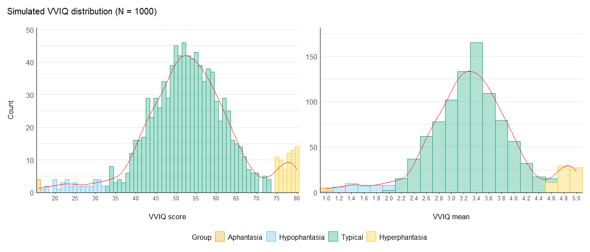

# Simulating Likert-type questionnaire data with R


I have been working on multiple projects that involved analysing
questionnaires with “Likert scales”, i.e. ordinal variables or
pseudo-continuous variables obtained by summing all the ordinal items.
Before engaging into the experiments proper, we should conduct robust
power analyses, code testing, sanity checks, etc. to ensure that the
data collection and analysis will be as smooth as possible. In several
complex settings such as multivariate analyses or multilevel modelling,
simulation can be a powerful tool to do these tasks by allowing to test
intricate computations on synthetic data.

> I found out (*after the deed, of course*) that several packages
> already existed that could have eased my work. The closest to what I
> coded here is the
> [`LikertMakeR`](https://github.com/WinzarH/LikertMakeR) package, which
> is really comprehensive. Also check out
> [`latent2likert`](https://github.com/markolalovic/latent2likert) for a
> more item-based simulation approach. Still, I feel like I came up with
> pretty straightforward solutions to my problems so I decided to share
> them. *Note: this is not a package, simply because I haven’t had the
> time to learn how to make one. I’m just sharing some scripts that I
> believe could be useful.*

This repository contains code to simulate data from two mental imagery
questionnaires I used often: the [Vividness of Visual Imagery
Questionnaire
(VVIQ)](https://bpspsychub.onlinelibrary.wiley.com/doi/10.1111/j.2044-8295.1973.tb01322.x)
and the [Object-Spatial Imagery and Verbal
Questionnaire](https://onlinelibrary.wiley.com/doi/10.1002/acp.1473).
The simulation script (`scripts/simulate_questionnaires.R`) is heavily
commented to explain the rationale behind the code and the choices made.
The script is also designed to be adaptable to other questionnaires.

<!-- It shows methods to: -->
<!-- -   Simulate score distributions from various types of information (e.g., quantile percentages, means, sd, skewness). -->
<!-- -   Simulate different distributions for sub-scales or sub-groups in the sample. -->
<!-- -   Correlate sub-scales with different types of distributions. -->
<!-- -   Simulate individual ordinal items from the total scores of each subject. -->

`scripts/plot_questionnaires.R` contains two functions associated with
the questionnaires to provide convenient plotting methods.

## Examples

``` r
source("scripts/simulate_questionnaires.R")
source("scripts/plot_questionnaires.R")
```

`simulate_vviq` creates a data frame with a given number of subjects,
simulating VVIQ scores and means for four groups defined in aphantasia
literature (aphantasia, hypophantasia, typical imagery and
hyperphantasia, see [Wright et al.,
2024](https://www.frontiersin.org/journals/psychology/articles/10.3389/fpsyg.2024.1454107/full)).
It can optionally simulate individual responses for all of the 16 items
of the VVIQ for each subject (all responses of course summing to the
simulated score).

``` r
df_vviq <- simulate_vviq(n_subjects = 1000, add_items = TRUE)

df_vviq |> 
  group_by(group) |> 
  slice(1) |> 
  display()
```

| subject | group | score_vviq | mean_vviq | vviq_item_1 | vviq_item_2 | vviq_item_3 | vviq_item_4 | vviq_item_5 | vviq_item_6 | vviq_item_7 | vviq_item_8 | vviq_item_9 | vviq_item_10 | vviq_item_11 | vviq_item_12 | vviq_item_13 | vviq_item_14 | vviq_item_15 | vviq_item_16 |
|:---|---:|---:|---:|---:|---:|---:|---:|---:|---:|---:|---:|---:|---:|---:|---:|---:|---:|---:|---:|
| 34 | aph | 16 | 1.00 | 1 | 1 | 1 | 1 | 1 | 1 | 1 | 1 | 1 | 1 | 1 | 1 | 1 | 1 | 1 | 1 |
| 11 | hypo | 21 | 1.31 | 1 | 1 | 2 | 1 | 1 | 1 | 2 | 1 | 1 | 3 | 1 | 1 | 1 | 2 | 1 | 1 |
| 1 | typical | 55 | 3.44 | 3 | 2 | 2 | 1 | 4 | 3 | 4 | 5 | 4 | 4 | 4 | 3 | 3 | 3 | 5 | 5 |
| 37 | hyper | 80 | 5.00 | 5 | 5 | 5 | 5 | 5 | 5 | 5 | 5 | 5 | 5 | 5 | 5 | 5 | 5 | 5 | 5 |

`simulate_osivq` does the same for the OSIVQ, which comprises three
sub-scales: Object, Spatial and Verbal. There are no conventional
thresholds to define groups for this questionnaire.

``` r
df_osivq <- simulate_osivq(n_subjects = 1000, add_items = TRUE)

df_osivq |> 
  head() |> 
  display()
```

| mean_object | mean_spatial | mean_verbal | score_object | score_spatial | score_verbal | osivq_item_o_1 | osivq_item_o_2 | osivq_item_o_3 | osivq_item_o_4 | osivq_item_o_5 | osivq_item_o_6 | osivq_item_o_7 | osivq_item_o_8 | osivq_item_o_9 | osivq_item_o_10 | osivq_item_o_11 | osivq_item_o_12 | osivq_item_o_13 | osivq_item_o_14 | osivq_item_o_15 | osivq_item_s_1 | osivq_item_s_2 | osivq_item_s_3 | osivq_item_s_4 | osivq_item_s_5 | osivq_item_s_6 | osivq_item_s_7 | osivq_item_s_8 | osivq_item_s_9 | osivq_item_s_10 | osivq_item_s_11 | osivq_item_s_12 | osivq_item_s_13 | osivq_item_s_14 | osivq_item_s_15 | osivq_item_v_1 | osivq_item_v_2 | osivq_item_v_3 | osivq_item_v_4 | osivq_item_v_5 | osivq_item_v_6 | osivq_item_v_7 | osivq_item_v_8 | osivq_item_v_9 | osivq_item_v_10 | osivq_item_v_11 | osivq_item_v_12 | osivq_item_v_13 | osivq_item_v_14 | osivq_item_v_15 |
|:---|---:|---:|---:|---:|---:|---:|---:|---:|---:|---:|---:|---:|---:|---:|---:|---:|---:|---:|---:|---:|---:|---:|---:|---:|---:|---:|---:|---:|---:|---:|---:|---:|---:|---:|---:|---:|---:|---:|---:|---:|---:|---:|---:|---:|---:|---:|---:|---:|---:|---:|
| 3.91 | 2.84 | 3.27 | 58 | 42 | 49 | 5 | 2 | 5 | 2 | 4 | 2 | 5 | 5 | 5 | 3 | 4 | 4 | 3 | 5 | 4 | 3 | 4 | 3 | 1 | 1 | 1 | 5 | 2 | 3 | 2 | 2 | 5 | 3 | 3 | 4 | 5 | 2 | 1 | 3 | 5 | 4 | 2 | 2 | 5 | 2 | 4 | 5 | 3 | 4 | 2 |
| 3.45 | 2.80 | 3.56 | 51 | 42 | 53 | 2 | 4 | 3 | 4 | 2 | 5 | 4 | 3 | 3 | 4 | 3 | 2 | 5 | 5 | 2 | 1 | 5 | 1 | 2 | 3 | 2 | 5 | 5 | 2 | 3 | 3 | 1 | 4 | 2 | 3 | 2 | 5 | 4 | 5 | 5 | 3 | 5 | 3 | 4 | 2 | 5 | 2 | 1 | 5 | 2 |
| 3.65 | 2.48 | 2.97 | 54 | 37 | 44 | 5 | 3 | 5 | 3 | 3 | 5 | 2 | 3 | 2 | 3 | 3 | 2 | 5 | 5 | 5 | 5 | 2 | 2 | 1 | 1 | 2 | 5 | 2 | 3 | 2 | 1 | 2 | 2 | 5 | 2 | 3 | 1 | 1 | 1 | 1 | 5 | 5 | 4 | 3 | 3 | 2 | 3 | 5 | 4 | 3 |
| 3.56 | 2.84 | 2.91 | 53 | 42 | 43 | 4 | 4 | 4 | 4 | 3 | 3 | 5 | 3 | 3 | 5 | 2 | 2 | 2 | 4 | 5 | 1 | 5 | 3 | 2 | 2 | 5 | 1 | 1 | 4 | 2 | 2 | 2 | 5 | 2 | 5 | 2 | 3 | 2 | 4 | 3 | 1 | 2 | 2 | 3 | 4 | 5 | 3 | 3 | 2 | 4 |
| 3.29 | 2.08 | 2.18 | 49 | 31 | 32 | 5 | 2 | 2 | 4 | 2 | 5 | 3 | 5 | 5 | 1 | 3 | 4 | 3 | 1 | 4 | 2 | 2 | 1 | 5 | 2 | 1 | 2 | 2 | 1 | 1 | 3 | 1 | 3 | 2 | 3 | 1 | 1 | 2 | 3 | 2 | 4 | 2 | 2 | 1 | 4 | 1 | 1 | 3 | 2 | 3 |
| 3.71 | 4.21 | 1.88 | 55 | 63 | 28 | 5 | 5 | 3 | 4 | 4 | 4 | 5 | 1 | 5 | 4 | 2 | 4 | 1 | 5 | 3 | 4 | 5 | 5 | 4 | 5 | 5 | 5 | 5 | 4 | 3 | 4 | 2 | 3 | 4 | 5 | 2 | 1 | 2 | 2 | 2 | 1 | 3 | 1 | 3 | 1 | 1 | 1 | 3 | 1 | 4 |

Two plotting functions, `plot_vviq` and `plot_osivq`, are provided to
plot the distributions of the scores and means of the VVIQ and OSIVQ,
respectively. They can be called with the argument `print = TRUE` to
display the plot directly in the console. In any case, they return a
ggplot object that can be further customized.

``` r
vviq_scores <- df_vviq |> plot_vviq(var = "score", print = FALSE)
vviq_means  <- df_vviq |> plot_vviq(var = "mean", print = FALSE) + 
  labs(title = NULL, y = NULL)

osivq_scores <- df_osivq |> plot_osivq(var = "score", print = FALSE)
osivq_means  <- df_osivq |> plot_osivq(var = "mean", print = FALSE) + 
  labs(title = NULL, y = NULL)

# Laying out the four plots with the `patchwork` package
(vviq_scores + vviq_means) / (osivq_scores + osivq_means) + 
  plot_layout(guides = "collect")
```



I believe the structures presented in these scripts could be useful to
anyone who needs to simulate Likert-type questionnaire data. The scripts
are designed to be easily adaptable to other questionnaires and can be
used as templates to build your own simulation scripts. I hope they will
be useful to you! :cherry_blossom:

> Note: this repository is a Quarto project endowed with a `renv` R
> environment to ensure the stability of the packages used. The
> repository is based on [this Quarto project
> template](https://github.com/m-delem/my-quarto-template): you can find
> a quick tutorial to use this project structure and an in-depth
> explanation of its elements in the README of the template.
